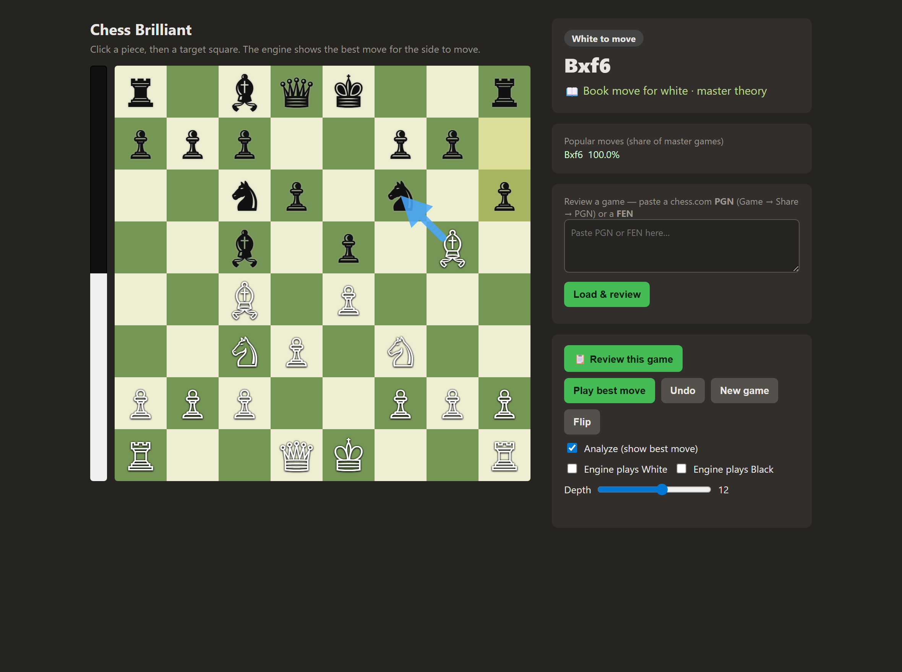
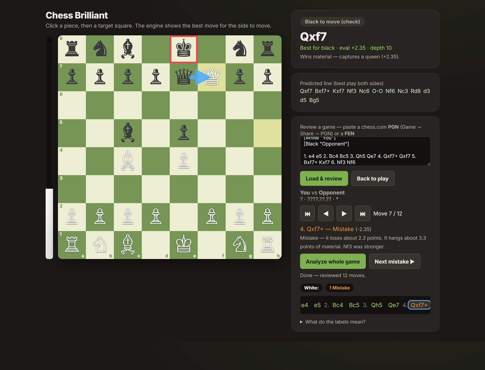

# Chess Brilliant

A chess engine that **predicts best play to the end of the game** and **finds
brilliant moves** (sound sacrifices), built in two layers:

- **`engine/`** — a from-scratch **Rust UCI chess engine** (the speed-critical core).
- **`analysis/`** — a **Python layer** (built on `python-chess`) that drives the
  engine and adds prediction + brilliancy detection.

The engine speaks the **UCI protocol**, so it also works in any chess GUI
(Arena, Cute Chess, BanksiaGUI, ...) — point the GUI at the compiled binary.

---

## Screenshots

**Play board** — click to move; the engine shows the best move for the side to
move (arrow), the evaluation bar, and opening-book theory:



**Game Review** — step through a game (yours or a pasted PGN). Every move is
graded with a plain-English explanation of *why*, the move list is colour-coded,
and a summary counts each side's mistakes:



---

## How it works

### The engine (Rust)
| Component | What it does |
|-----------|--------------|
| Bitboard board + move gen | Legal moves, validated by **perft** against known reference counts |
| PeSTO evaluation | Tapered material + piece-square tables (mid/endgame interpolation) |
| Search | Negamax **alpha-beta**, iterative deepening, quiescence, transposition table, late-move reductions, killer/history move ordering |
| UCI loop | Talks to Python and any chess GUI |

"Predict the opponent's moves to the end of the game" = the engine's **principal
variation** (its predicted best line for *both* sides), plus a full **rollout**
that plays the game out to checkmate/draw.

### Brilliancy detection (Python)
A move is flagged **Brilliant (`!!`)** when:
1. it is the **best or near-best** move (doesn't throw away the position),
2. it **sacrifices real material** — after the move the opponent can win
   ≥ ~a minor piece by a static-exchange capture (computed via **SEE**), and
3. the position **stays good** for the mover despite the sacrifice (the engine
   sees compensation a naive material count would miss).

Every other move gets a chess.com-style label: Best / Excellent / Good /
Inaccuracy / Mistake / Blunder, based on centipawns lost vs. the best move.

---

## Quick start (Windows)

Double-click **`run.bat`** (or run `.\run.bat`). It builds the engine if needed,
installs Python deps if needed, opens your browser, and starts the server at
**http://127.0.0.1:5000**. Press Ctrl+C to stop.

## Build & setup

```bash
# 1. Build the Rust engine (needs Rust/cargo)
cd engine
cargo build --release        # produces engine/target/release/chess_engine[.exe]

# 2. Install the Python dependency
pip install chess
```

## Play & analyze in the browser

A playable board that uses the engine as a live analyzer:

```bash
cd analysis
pip install flask          # one time
python server.py           # then open http://127.0.0.1:5000
```

- Click a piece, then a target square to move (for either colour).
- A blue **arrow shows the best move** for the side to move; the eval bar and
  side panel show the evaluation and the predicted line. A **cyan arrow + "!!
  Brilliant" badge** appears when the best move is a sound sacrifice.
- Controls: **Play best move** (engine moves for you), **Undo**, **New game**,
  **Flip**, a **depth** slider, an **Analyze** toggle (turn engine off to just
  play), and "Engine plays White/Black" to play a full game against the engine.

### Game Review (learn from your games)
Two ways to start a review:
- **Play on the board, then click "📋 Review this game"** to review the game you
  just played.
- Or paste a **PGN** (chess.com → a game → Share → PGN) or a **FEN** into the
  "Review a game" box and click **Load & review**.

Then:
- **Step through** the game (⏮ ◀ ▶ ⏭ or the ← → arrow keys).
- Every move is **graded** — Brilliant / Great / Best / Excellent / Good /
  Inaccuracy / Mistake / Blunder — colour-coded, each with a plain-English
  **explanation of *why*** (e.g. "Brilliant — sacrifices ~9 points but forces
  mate", "Great — the only move that holds; alternatives were clearly worse",
  "Blunder — it hangs ~3.3 points of material; Nf3 was needed"). A legend under
  the move list explains every label. "Great" (only-move) is detected by asking
  the engine for the best *alternative* via UCI `searchmoves`.
- The board shows the **best-move arrow** for the side to move at each step.
- **Analyze whole game** grades all moves and shows a per-side summary
  (how many blunders/mistakes each side made); **Next mistake ▶** jumps to the
  next place someone went wrong — the moments worth studying.

#### Learning from your mistakes
After **Analyze whole game**, the engine **learns from every mistake**: for each
Inaccuracy/Mistake/Blunder it analyses the position deeper and stores the correct
move in a persistent learning file (`analysis/books/learned.json`, keyed by
position). Next time you reach that position — playing or reviewing — it instantly
**recalls the learned move** (shown with a 📚 badge) instead of recomputing it,
and reminds you what you played wrong. The knowledge accumulates across games and
survives restarts. (This is a classical engine "learning file" — verified
knowledge keyed by position, not neural-network retraining.)

This is the right way to use the engine for learning: review *finished* games,
not live ones.

**Responsiveness:** moves apply instantly (the engine never blocks them);
analysis arrives a moment later as a separate request. The opening is looked up
in a **Polyglot opening book** (`analysis/books/book.bin`) — instant, with
master-game popularity — so the engine only searches once you leave theory.
Out-of-book searches are time-capped (~0.7s) and cached by position. If the book
file is absent, the engine simply searches from move one.

## Command-line usage

```bash
cd analysis

# Analyse a position: best move, evaluation, predicted line, brilliancy check
python analyze.py fen "5r1k/6pp/7N/3Q4/8/8/6PP/6K1 w - - 0 1"

# Judge a specific move (is it brilliant? a blunder?)
python analyze.py move "<FEN>" d5g8

# Find a brilliant move if one exists
python analyze.py brilliant "<FEN>"

# Predict the whole game to its end (engine vs engine)
python analyze.py predict "<FEN>"

# Scan a PGN game, classifying every move and listing brilliancies
python analyze.py pgn game.pgn

# Control search depth (default 14)
python analyze.py --depth 18 move "<FEN>" b3b8

# Watch the engine think: stream each search depth live (score + line)
python analyze.py -v fen "<FEN>"
```

### Seeing the process live
- `-v` / `--verbose` streams the engine's search as it deepens — each line shows
  `depth`, score, nodes, nps, and the predicted line in SAN, e.g.:
  ```
  Thinking...
    depth  1    +8.36  nodes        54  nps    54000  pv: Nf5
    depth  2       #2  nodes       285  nps   285000  pv: Qg8+ Rxg8 Nf7#
  ```
- The `pgn` scan prints live per-move progress (`[12/33] 6...Nf6 ...` → verdict).
- All output is line-buffered, so it streams even when piped to a file or `tee`.

### Validate the engine yourself
```bash
cd engine
./target/release/chess_engine perft 5      # start position: expects 4865609
./target/release/chess_engine hashcheck    # validates incremental Zobrist hashing
```

---

## Layout
```
engine/src/
  types.rs      colors, pieces, squares, compact Move encoding
  tables.rs     precomputed attack tables + sliding-piece attacks
  zobrist.rs    Zobrist hashing keys
  position.rs   board state, FEN, make/unmake, attack queries
  movegen.rs    pseudo-legal generation + legality filter
  perft.rs      move-generation correctness test
  eval.rs       PeSTO tapered evaluation
  search.rs     alpha-beta search
  uci.rs        UCI protocol loop
analysis/
  engine.py      UCI driver: best move, eval, predicted line, rollout
  see.py         static exchange evaluation (sacrifice detection)
  brilliancy.py  move classification + brilliant-move detection
  book.py        Polyglot opening-book lookup
  analyze.py     command-line interface
  server.py      Flask web server (play + game review)
  web/index.html the browser UI (board, arrows, review panel)
  books/book.bin Polyglot opening book (GM games)
run.bat          one-click launcher (Windows)
```

## Credits
- Web UI styling follows a three-layer design-token system (primitive →
  semantic → component) from the
  [ui-ux-pro-max](https://github.com/nextlevelbuilder/ui-ux-pro-max-skill)
  design skill — WCAG-AA contrast, consistent spacing/typography scales,
  visible focus rings, and `prefers-reduced-motion` support.
- Opening book: `gm2001.bin` (Polyglot, GM games).

## Status / ideas for next steps
Done: from-scratch Rust engine (perft-validated), PeSTO eval, alpha-beta search,
UCI, opening book, brilliancy detection, web play board, full Game Review with
per-move explanations and the "Great"/only-move tier (via `searchmoves`).

Possible next steps:
- **Accuracy %** per side in the review summary (chess.com-style).
- **Magic bitboards** for faster sliding-piece move generation.
- **Endgame tablebase** probing for perfect endgame play.
- **Explore variations** during review (try a move, see how the eval changes).
- A larger opening book for deeper theory coverage.
